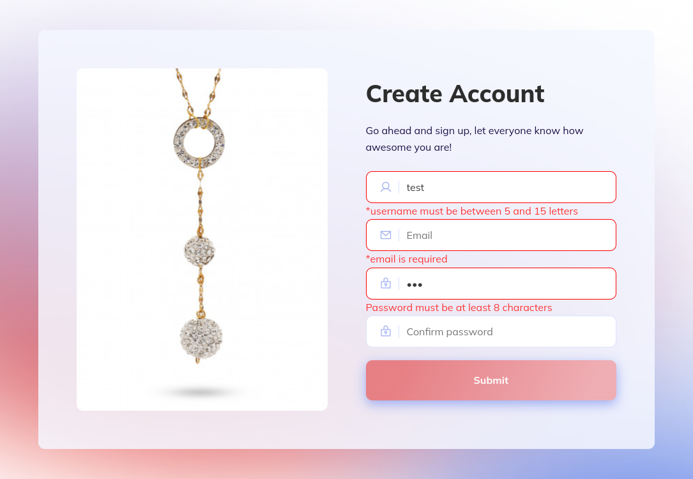

# Project Title

Simple Form Validation

## Description

This project implements a simple client-side and server-side form validation using HTML, CSS, and JavaScript. The form contains fields for name, email, and password. Form data is validated on submit, and error messages are displayed if any field is invalid.

The main goals of this project are:

- Practice form validation using JavaScript to ensure data integrity
- Provide a user-friendly experience with clear validation messages and visual cues
- Implement a responsive and mobile-friendly form layout for seamless usage across devices
- Showcase clean and maintainable HTML and CSS code

## Live Demo

You can view a live demo of the form [here](https://mohamedtharwat000.github.io/form1/).

Try submitting the form with both invalid and valid values to see the validation in action.

_screenshots_

## Features

The form has the following features:

- Name field validation:

  - Ensures the name field is not empty.
  - Validates that the name contains only letters and is between 5 and 15 characters long.

- Email field validation:

  - Ensures the email field is not empty.
  - Validates that the email follows a valid email format.

- Password field validation:

  - Ensures the password field is not empty.
  - Validates that the password is at least 8 characters long.

- Error messages:

  - Error messages are displayed in red below each field when they are invalid.
  - Form fields are highlighted in red to provide visual feedback on invalid inputs.

- Success message:

  - When the form is submitted successfully, a green success message is displayed.

- Mobile responsive design:
  - The form layout is responsive and adapts to different screen sizes for a seamless experience on mobile devices.

## Development

This project uses vanilla HTML, CSS, and JavaScript, so no special build process is required. To run it locally:

1. Clone the repository.
2. Open `index.html` in your browser.

To make changes:

- Update HTML files to modify the form structure.
- Edit style files to customize the look and feel.
- Modify JavaScript files to enhance or customize the form validation logic.

## Contributing

Contributions are welcome! Here are some ways you can contribute to this project:

- Report bugs and issues by creating a new GitHub issue.
- Fix bugs and issues by submitting pull requests.
- Add new validation functionality to enhance the form's capabilities.
- Improve styling and overall user experience.
- Refactor code to improve code quality and maintainability.
- Write documentation and improve existing docs to help others understand the project.

To contribute:

1. Fork the repository.
2. Create a new branch for your feature or bug fix.
3. Make your changes and commit them.
4. Push your branch to your forked repository.
5. Submit a pull request, describing your changes in detail.

I will review pull requests and provide feedback.

## License

This project is open source and available under the [MIT License](LICENSE).

## Credits

Created by [Mohamed Tharwat](https://github.com/mohamedtharwat000). Feel free to reach out with any questions or feedback.
